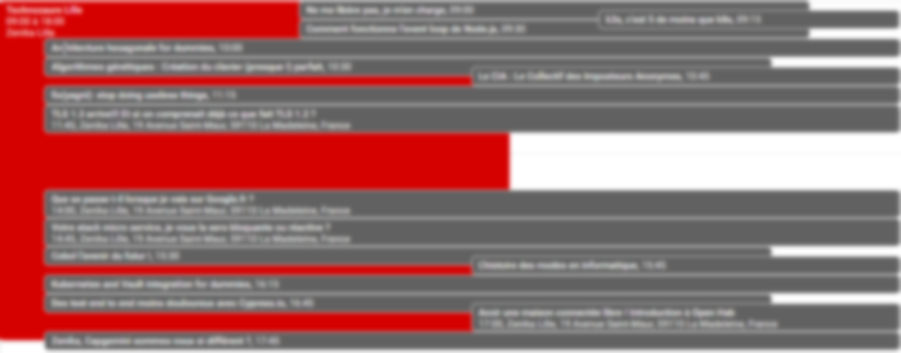

# conference-hall-to-calendar
Generate a list of calendar events from a conference-hall JSON export

A typical generated schedule would look like this

## Getting Started

These instructions will get you a copy of the project up and running on your local machine for development and testing purposes. See deployment for notes on how to deploy the project on a live system.

### Prerequisites

Install Python 3 and pip

Generate a Google Agenda `credentials.json` file (see in [Python Quickstart](https://developers.google.com/calendar/quickstart/python))

### Installing

Checkout this project

Then `pip install -r requirements.txt`

And you're ready to go !

### Running the script

To run the script, you need to have an existing Google Agenda `credentials.json`.
To obtain it, you'll have to create a google api account, add the Google Agenda API, then download the `credentials.json` file.
See [Google API Authentication](https://flaviocopes.com/google-api-authentication/) as an example documentation.

Copy the `config-example.json` file and change it according to your needs (it should be documented enough for you to understand).
Typically, you should have to change the used `dates` which contain the time slots for conferences.

Now you can run the script with `python transformer.py`!

## Running the tests

There are no automated tests, sorry

## Deployment

There is no deployment needed, just run this script from your machine

## Contributing

Just submit pull request, and if it is good, it will go !

## Versioning

I'm not aware of Python versionning :-(

## Authors

* **Nicolas Delsaux** - *Initial work* - [Riduidel](https://github.com/Riduidel)

See also the list of [contributors](https://github.com/your/project/contributors) who participated in this project.

## License

This project is licensed under the GNU GENERAL PUBLIC LICENSE - see the [LICENSE.md](LICENSE.md) file for details

## Acknowledgments

* Thanks to authors of conference-hall.io
* Thanks to Seb Velay for ideas on how to use Google correctly

